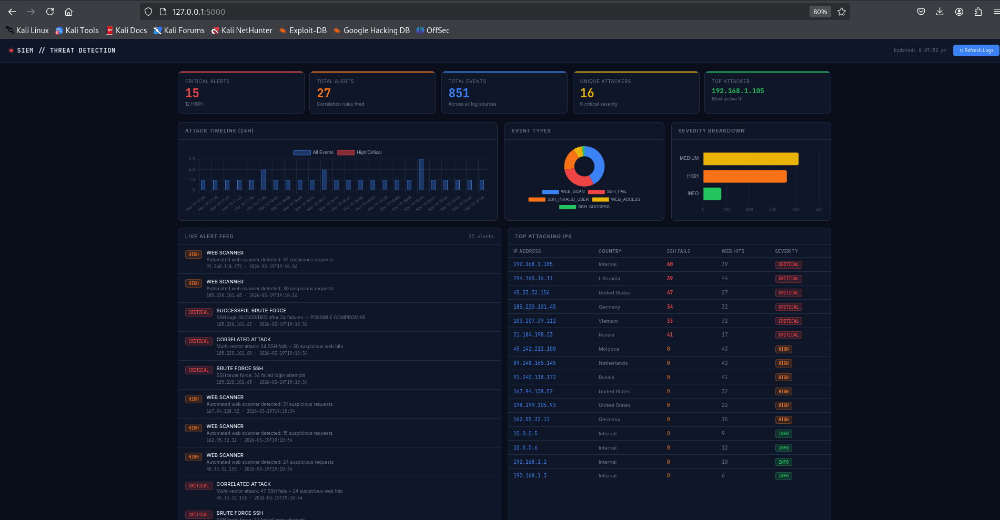

# SIEM-Style Threat Detection Dashboard

A production-grade Security Information and Event Management (SIEM) dashboard that ingests multiple log sources, correlates events across sources, enriches attacker IPs with GeoIP data, fires detection rules, and visualises everything on a real-time web dashboard.

Built as part of a cybersecurity portfolio to demonstrate SOC analyst and security engineering skills.

---

## Features

| Feature | Details |
|---|---|
| **Multi-source ingestion** | Parses SSH auth.log + Apache access.log simultaneously |
| **Correlation engine** | 4 detection rules: brute force, multi-vector attack, successful compromise, web scanner |
| **GeoIP enrichment** | Resolves attacker IPs to country/city/ISP using ip-api.com (free, no key) |
| **Severity scoring** | Every event and IP gets a CRITICAL/HIGH/MEDIUM/INFO score |
| **Live dashboard** | Real-time Flask web UI with Chart.js — timeline, doughnut, bar charts |
| **Alert feed** | Deduplicated correlated alerts with rule names and descriptions |
| **Raw event log** | Paginated, filterable table of all parsed events |
| **Geo intelligence** | Table of attacker IPs with country, city, ISP, attack counts |
| **One-click refresh** | Re-ingest logs without restarting the server |

## Screenshots

> Add screenshots of the dashboard here after running

## Tech Stack

- **Backend:** Python 3, Flask, SQLite (stdlib)
- **Parsing:** Regex-based log parsers for auth.log and Apache combined log format
- **GeoIP:** ip-api.com REST API (free, 45 req/min, no API key)
- **Frontend:** Vanilla JS + Chart.js 4.x (CDN)
- **Database:** SQLite (zero setup)

**Total cost: ₹0**

## Quick Start

### Step 1 — Install dependencies
```bash
pip install -r requirements.txt
```

### Step 2 — Demo mode (sample logs)
```bash
python3 generate_sample_logs.py   # creates logs/auth.log and logs/apache.log
python3 app.py --demo             # starts server on http://localhost:5000
```

### Step 3 — Real logs (Kali Linux)
```bash
sudo python3 app.py               # reads /var/log/auth.log and /var/log/apache2/access.log
```

### Step 4 — Open dashboard
Navigate to **http://localhost:5000** in your browser.

## Detection Rules

| Rule | Trigger | Severity |
|---|---|---|
| `BRUTE_FORCE_SSH` | ≥5 failed SSH attempts from same IP | HIGH |
| `BRUTE_FORCE_SSH` | ≥20 failed SSH attempts from same IP | CRITICAL |
| `CORRELATED_ATTACK` | Same IP: ≥3 SSH fails + ≥3 suspicious web hits | CRITICAL |
| `SUCCESSFUL_BRUTE_FORCE` | SSH login succeeded after ≥5 failures | CRITICAL |
| `WEB_SCANNER` | ≥10 suspicious web requests from same IP | HIGH |

## Project Structure

```
siem-dashboard/
├── app.py                    # Flask server + REST API endpoints
├── parser.py                 # Log parsers + GeoIP + correlation engine
├── generate_sample_logs.py   # Generates realistic test logs
├── requirements.txt
├── DISCLAIMER.md
├── logs/                     # Sample logs (generated)
├── data/                     # SQLite database (auto-created)
└── templates/
    └── index.html            # Dashboard UI
```

## Skills Demonstrated

- Python log parsing with regex (auth.log, Apache combined format)
- SQLite database design and querying
- REST API design with Flask
- Security event correlation and detection rule logic
- GeoIP enrichment via external API
- Frontend data visualisation with Chart.js
- Full-stack web application development

## Legal

See [DISCLAIMER.md](DISCLAIMER.md). All testing performed in isolated lab environment only.

